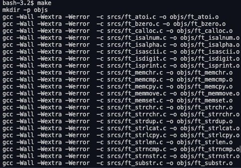

# Libft

A C Library for 42 school projects.

# Purpose

This Project aims to introduce 42 students to the highly useful standard functions in C by rewriting those functions from scratch.

# Usage

``make`` : compiles library without bonus functions

``make bonus`` : compiles library with bonus functions

# Exemple of compilation

